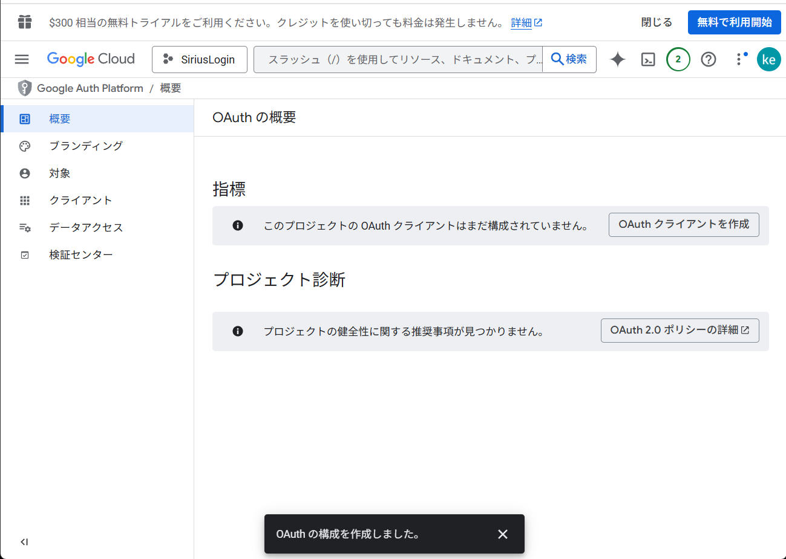

# シリウス自動ログイン
## 導入方法
### 1.ダウンロード
githubのページ(https://github.com/aurl271/Sirius_login )の右上にある緑色のCodeをクリックし、Download Zipでダウンロードして解凍

### 2.sesion.jsの編集
解凍したフォルダにあるsession.jsの1行目の` document.getElementById('identifier').value = "hogehoge";` のhogehogeをTUAT-ID(s~~v)に変更
4行目の` document.getElementById('password').value = "fugafuga";`のfugafugaをパスワードに変更
### 3.拡張機能として追加
メニューバーから「拡張機能を管理」をクリック

「パッケージ化されてない拡張機能を読み込む」から解凍したフォルダ(session.jsとかが入っているフォルダ)を選択する

### 4.GmailAPIを使えるようにする
**ワンタイムパスワードを受け取るアカウント**でhttps://console.cloud.google.com/welcome にアクセスして、「プロジェクトの選択」から「新しいプロジェクト」をクリック

適当なプロジェクト名を入力して、作成をクリック

https://console.cloud.google.com/welcome に戻って、今作ったプロジェクトを選択
左上の3本線のメニューバーをクリックし、「APIとサービス」から「有効なAPIとサービス」をクリック

「APIとサービスを有効にする」をクリックし、検索ボックスでGmailと入力して、「Gmail API」を開きGmailAPIを有効にする

メニューバー「APIとサービス」から「認証情報」へ移動、「同意画面を構成」をクリックし、「開始」をクリック

適当なアプリ名を入力し、ユーザーサポートメールを自分のアカウントで設定、対象を外部に設定、連絡先情報を自分のアカウントで設定し、最後にポリシーに同意し作成をクリック

「OAuthクライアントを作成」をクリックし、「アプリケーションの種類」からChrome拡張機能を選択、適当な名前を入力、アイテムIDに拡張機能のID(拡張機能の管理から確認可能)を入力し、作成をクリック

「JSONをダウンロード」をクリックし、ダウンロードしたJSONを解凍したフォルダに移し、そこにあるmanifest.jsonの`"client_id": "～～.apps.googleusercontent.com"`の～～.apps.googleusercontent.comの部分を今ダウンロードしたJSONの`"Client_id":"～～.apps.googleusercontent.com"`の～～.apps.googleusercontent.comに書き換える

## 注意点
- 最初のログインをするときはGmailAPIを使えるようにするためにログインとアクセス許可の画面が表示されると思います。
- session.js,second_factor.jsのsetTimeoutの第二引数の数値を変えればボタンを押すタイミングを変えることができます。(速すぎるとうまくいかなかったです)
